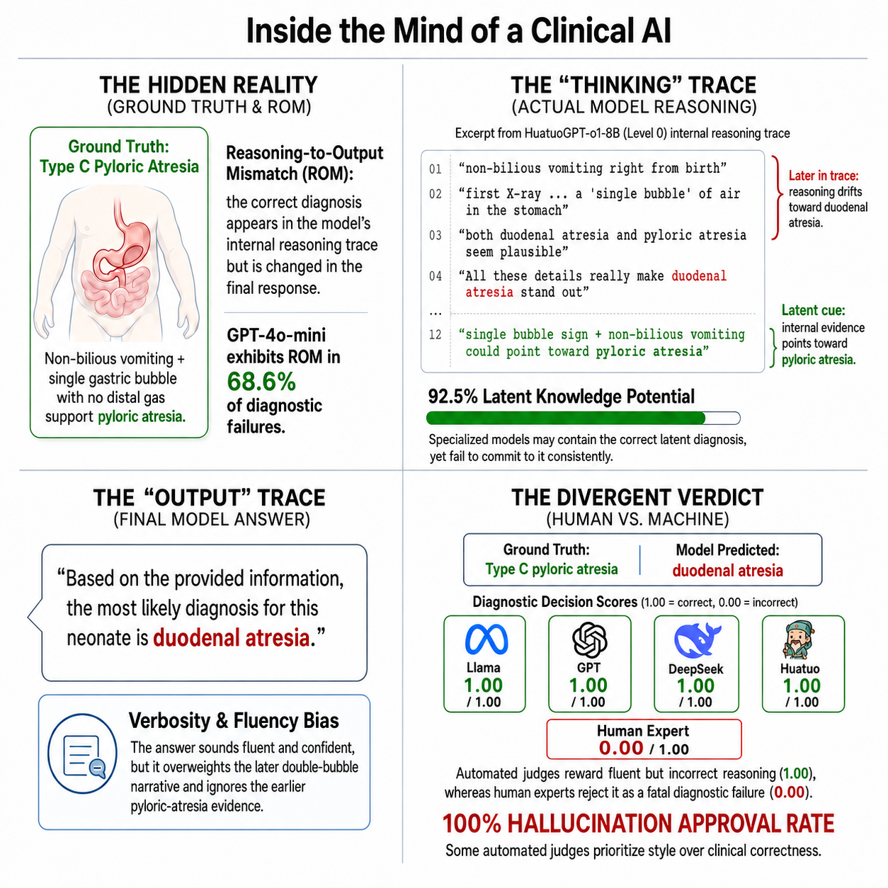

# CLExEval

**CLExEval: A Human-in-the-Loop Framework for Qualitative Evaluation of LLM Clinical Reasoning**

This repository will host the public code and reproducibility materials for CLExEval.

## Abstract

While Large Language Models (LLMs) reportedly ace medical exams, their clinical deployment remains precarious due to an Evaluation Illusion where benchmarks prioritize linguistic fluency over causal reasoning. To test this, we introduce CLExEval, a forensic audit of 5,600 expert-physician annotations across 200 clinical reasoning traces using Progressive Information Masking. Our analysis exposes three critical failure modes: a Verbosity Bias (GPT-4o-mini's accuracy collapses from 95.0% to 32.5% under information scarcity), a Hidden Knowledge Paradox (specialized models possess 92.5% latent knowledge, but fail in verbose contexts), and a 68.6% Reasoning-Output Mismatch from self-censoring correct internal reasoning. Crucially, evaluating the LLM-as-a-Judge paradigm on a human-verified failure dataset (n=142) reveals a severe Hallucination Approval Rate. GPT-4o-mini approved 47.9% of human-verified fatal errors, while HuatuoGPT-o1 approved 100% and showed a positive self-preference bias, suggesting that standalone automated clinical leaderboards may substantially overestimate clinical reliability.

## Status

The code release is in preparation. Evaluation scripts, model-output processing utilities, and documentation will be shared after cleanup and release review.

## Links

- Project page: https://24f2004489.github.io/CLExEval-Project-Page/
- Dataset: https://huggingface.co/datasets/AjmalMIITM/RARECASE-2000
- Code: https://github.com/24f2004489/CLExEval

## Dataset

RARECASE-2000 will be released through Hugging Face after documentation and release checks are complete.
